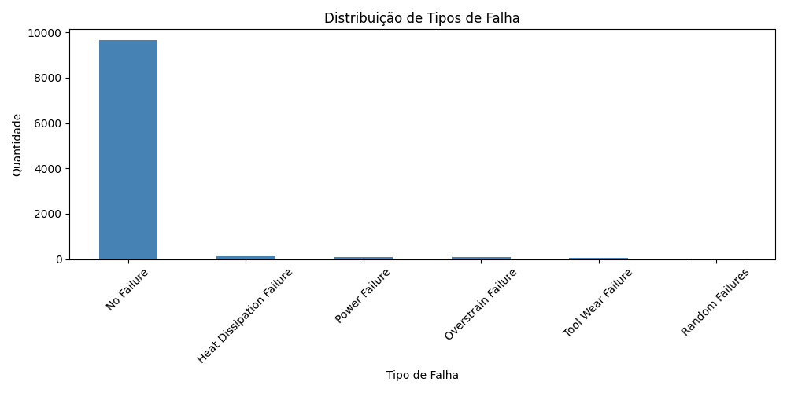
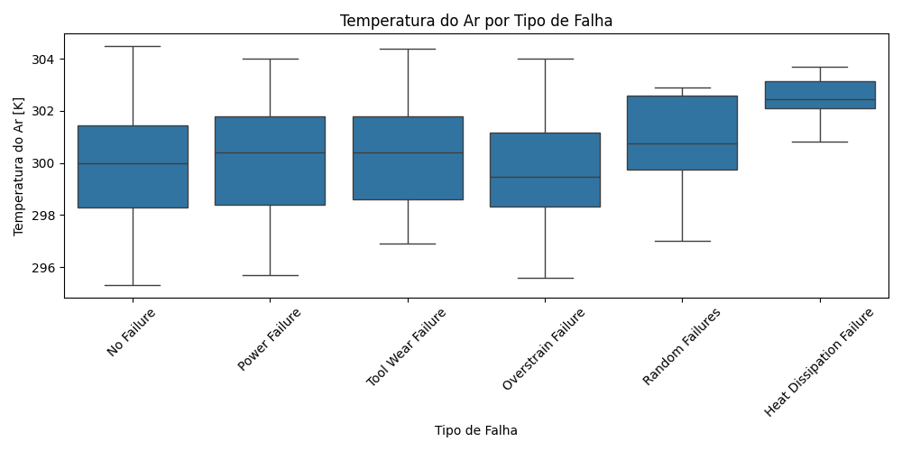
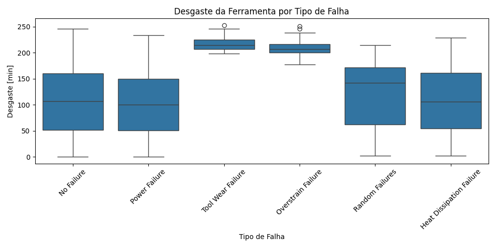

# 🔧 Análise de Manutenção Preditiva Industrial

> Análise exploratória de dados de sensores de máquinas industriais com Python, Pandas e Matplotlib.

---

## 📌 Sobre o Projeto

Este projeto é uma análise de dados provenientes de sensores de máquinas industriais. O objetivo é tratar os dados com a biblioteca Pandas, gerar gráficos para mostrar os padrões de falha e compará-los com outros dados dos sensores.

A análise busca responder perguntas como:
- Quais são os tipos de falha mais comuns?
- Existe relação entre a temperatura da máquina e o tipo de falha?
- O desgaste da ferramenta influencia no tipo de falha?

---

## 📊 Dataset

- **Fonte:** [Machine Predictive Maintenance Classification — Kaggle](https://www.kaggle.com/datasets/shivamb/machine-predictive-maintenance-classification)
- **Registros:** 10.000
- **Colunas:** 10

| Coluna | Descrição |
|---|---|
| `Air temperature [K]` | Temperatura do ar em Kelvin |
| `Process temperature [K]` | Temperatura do processo em Kelvin |
| `Rotational speed [rpm]` | Velocidade de rotação em RPM |
| `Torque [Nm]` | Torque em Newton-metro |
| `Tool wear [min]` | Desgaste da ferramenta em minutos |
| `Failure Type` | Tipo de falha registrada |

---

## 📈 Gráficos e Insights

### 1. Distribuição de Tipos de Falha


96% das máquinas não apresentam falha. Entre as falhas, as mais comuns são Heat Dissipation Failure, Power Failure e Overstrain Failure.

---

### 2. Temperatura do Ar por Tipo de Falha


Heat Dissipation Failure ocorre consistentemente em temperaturas mais altas que os demais tipos de falha — o que faz sentido fisicamente, pois falhas por dissipação de calor estão diretamente ligadas ao superaquecimento da máquina.

---

### 3. Desgaste da Ferramenta por Tipo de Falha


Tool Wear Failure e Overstrain Failure ocorrem quase sempre com desgaste acima de 200 minutos. Isso indica que programar a troca da ferramenta antes desse limite pode prevenir essas falhas.

---

## 🛠️ Tecnologias Utilizadas

| Biblioteca | Uso |
|---|---|
| `pandas` | Carregamento e tratamento dos dados |
| `matplotlib` | Geração de gráficos |
| `seaborn` | Gráficos estatísticos (boxplot) |

---

## 🚀 Como Executar

**1. Clone o repositório**
```bash
git clone https://github.com/vitorcunhap/analise-manutencao-preditiva
```

**2. Instale as dependências**
```bash
pip install pandas matplotlib seaborn
```

**3. Baixe o dataset**

Acesse o [link do Kaggle](https://www.kaggle.com/datasets/shivamb/machine-predictive-maintenance-classification), baixe o arquivo `predictive_maintenance.csv` e coloque na pasta do projeto.

**4. Execute o script**
```bash
python analise.py
```

---

## 📚 Aprendizados

- Carregamento e exploração de dados com Pandas
- Geração de gráficos com Matplotlib e Seaborn
- Análise exploratória de dados (EDA)
- Identificação de padrões de falha em dados industriais

---

## 👤 Vítor da Cunha Pereira

Engenheiro de Controle e Automação — UERGS  
Estudante de Engenharia de Dados e Machine Learning

---

## 📄 Licença

Este projeto é disponibilizado para fins educacionais.
